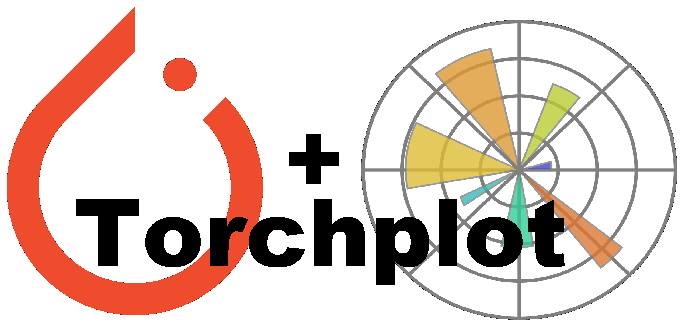

---

# torchplot - Plotting pytorch tensors made easy!

Ask yourself the following:
* Are you using `matplotlib.pyplot` to plot pytorch tensors?
* Do you forget to call `.cpu().detach().numpy()` everytime you want to plot a tensor?

Then `torchplot` may be something for you. `torchplot` is a simple drop-in replacement
for plotting pytorch tensors. We simply override every `matplotlib.pyplot` function such
that pytorch tensors are automatically converted.

Simply just change your default `matplotlib` import statement:


Instead of
``` python
from matplotlib.pyplot import *
```
use
``` python
from torchplot import *
```
and instead of
``` python
import matplotlib.pyplot as plt
```
use
``` python
import torchplot as plt
```
Herafter, then you can remove every `.cpu().detach().numpy()` (or variations heroff) from
your code and everything should just work. If you do not want to mix implementations, 
we recommend importing `torchplot` as seperaly package:
``` python
import torchplot as tp
```

## Installation
Simple as
```
pip install torchplot
```

## Example

``` python
# lets make a scatter plot of two pytorch variables that are stored on gpu
import torch
import torchplot as plt
x = torch.randn(100, requires_grad=True, device='cuda')
y = torch.randn(100, requires_grad=True, device='cuda')
plt.plot(x, y, '.') # easy and simple
```

## Requirements
Tested using `torch>=1.6` and `matplotlib>=3.3.3` but should perfectly work with
both earlier and later versions.

## Licence

Please observe the Apache 2.0 license that is listed in this repository. 

## BibTeX
If you want to cite the framework feel free to use this (but only if you loved it 😊):

```bibtex
@article{detlefsen2021torchplot,
  title={TorchPlot},
  author={Detlefsen, Nicki S. and Hauberg, Søren},
  journal={GitHub. Note: https://github.com/CenterBioML/torchplot},
  year={2021}
}
```


